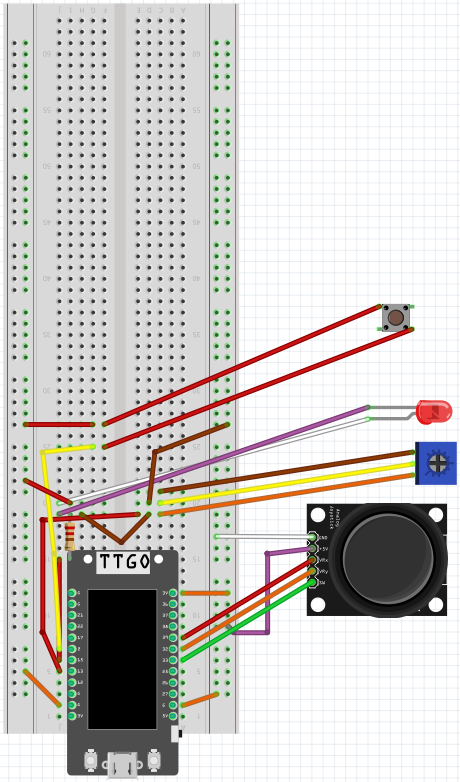
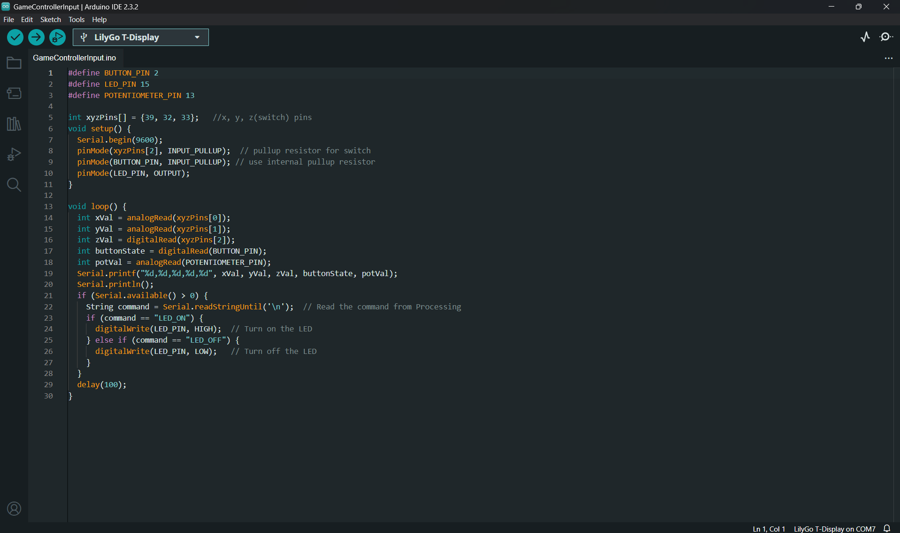

# Microcontroller Interactive Device Slice and Spice
A cooking themed interactive device that's a video game controller with game designed for an ESP32 microcontroller

*Here's a video of the display in action: https://youtu.be/tnQcMq5Ct8E?feature=shared*

## Blog Post

You can take an in depth look at my process making this program in this blog [post](https://brassy-moonflower-6cd.notion.site/Slice-and-Spice-S2-12d18fb9102d80a786a9e72461ec0fd8?pvs=4)

## Table of Contents

- [Materials](#what-youll-need)
- [Installation Process](#installation)
- [Design Process](#design-process-and-goals)
- [Demos](#demos)
- [Contributors](#contributors)

## What You'll Need

 + [Arduino IDE](https://www.arduino.cc/en/software)
 + [USB-C Cable](https://www.amazon.com/3-Pack-Charging-Compatible-Max%EF%BC%8CSamsung-MacBook/dp/B0C5DFLGZG/ref=sr_1_1_sspa?crid=1J4HMA8LN1V72&dib=eyJ2IjoiMSJ9._xXfHeYXKMA7uaVBojUx7_ztgfErVtQfGS9iKfENhIyM9fyMpbyxRjvtii0Tf4yjlhaQorsdAM6MqPXO7kg06HKjPVVsh_zgFfSz_lB3Mujs5SBqXuGu7unNou_67eJjPteECmqSqyQJ-3WuGb6hDoa6s259xWDlp3RHbFOKcesy0UrPyKvBnMEjzk1GGAZ03Xwczrl-2dIli56iUuHxdmXsHH5k_THtTmGIfckcIjEGKF9nE6xFW9s3R97vA62yXXxH0ugyjIF7hv7GUWTFIyp28Rhv76XkCkyQ2eFJeZs.HRGVQ5v8xi7RDidmZ1ULkysSISZY84_s3ymlprYzKoQ&dib_tag=se&keywords=usb+c+cable&qid=1730077700&s=industrial&sprefix=usb+c+cable%2Cindustrial%2C101&sr=1-1-spons&sp_csd=d2lkZ2V0TmFtZT1zcF9hdGY&psc=1)
 + [ESP32 TTGO T-display Microcontroller](https://www.amazon.com/LILYGO-T-Display-Arduino-Development-CH9102F/dp/B099MPFJ9M?th=1)
 + [Breadboard](https://www.amazon.com/EL-CP-003-Breadboard-Solderless-Distribution-Connecting/dp/B01EV6LJ7G/ref=sr_1_13?crid=34X8PPI0DBVGL&dib=eyJ2IjoiMSJ9.BTT8MNHPlv4K77wqKb52By9wqhO8D20fweqTDbF_zIHk5F4fE59hggxnrwNQ0WXhfMPsTKopU72QV0E78jfiJeR5fH1-r-5-Q2f62ZiWHZy7h65OjWKk6AgCtgvFMVlXVZRIG69yOyUzEbciKw3e_0OFfyMyl9X4n0FXea0pxpK48cyxgtQxq43lyiDW5DwjB_Bq3DIBwFvGlJIo2jblZUu4Ld4rmyKi2xe2b-mCMhnRSnCmMXatnHMNUDiWfaURxkgUqREv3SQr-E_y-4mr8S33kuJ5zt8PwSmC5mEf--Y._KngmxBR7CKm46j1rh--lnUGY7WhmwhG7h8K_bJS7Vw&dib_tag=se&keywords=breadboard&qid=1730077539&s=industrial&sprefix=breadboard%2Cindustrial%2C112&sr=1-13)
 + [LED](https://www.amazon.com/eBoot-Pieces-Emitting-Diodes-Assorted/dp/B06XPV4CSH/ref=sxin_15_pa_sp_search_thematic_sspa?content-id=amzn1.sym.76d54fcc-2362-404d-ab9b-b0653e2b2239%3Aamzn1.sym.76d54fcc-2362-404d-ab9b-b0653e2b2239&crid=FVWQEFJM55ZM&cv_ct_cx=led&dib=eyJ2IjoiMSJ9.6vTmBK01jW8wJBwOUYH4xvzriyO9okaUSxP_jGnIxj7gR22VdYdTLY2q7lrHvcw0XfBp4NyCxN4spTiCn2T5cw.0WNL8ceu-wkmdY7CIex0b0TGPI7ETN-mY5wlwOSa9dg&dib_tag=se&keywords=led&pd_rd_i=B06XPV4CSH&pd_rd_r=ecf755d8-b6c0-49b7-8226-2c16c6a4db1d&pd_rd_w=NgkGS&pd_rd_wg=t0sL4&pf_rd_p=76d54fcc-2362-404d-ab9b-b0653e2b2239&pf_rd_r=SDDGWE6V9XF473A2FCCH&qid=1730077498&s=industrial&sbo=RZvfv%2F%2FHxDF%2BO5021pAnSA%3D%3D&sprefix=led%2Cindustrial%2C92&sr=1-1-6024b2a3-78e4-4fed-8fed-e1613be3bcce-spons&sp_csd=d2lkZ2V0TmFtZT1zcF9zZWFyY2hfdGhlbWF0aWM&psc=1)
 + [Potentiometer](https://www.amazon.com/Molence-Breadboard-Potentiometer-Trimpot-Arduino/dp/B097TPRV61/ref=asc_df_B097TPRV61?tag=bingshoppinga-20&linkCode=df0&hvadid=80539416388073&hvnetw=o&hvqmt=e&hvbmt=be&hvdev=c&hvlocint=&hvlocphy=&hvtargid=pla-4584138884485526&psc=1&msclkid=fe5c01d3cd2b1c57530766cd2e2df2aa)
 + [Joystick](https://www.amazon.com/dp/B07Z44N6DG)
 + [Push Button](https://www.digikey.com/en/products/detail/sparkfun-electronics/COM-10302/5775291)
 + [Jumper Wires](https://www.digikey.com/en/products/detail/bud-industries/BC-32626/5291560)
 + [Male to Female Jumper Wires](https://www.digikey.com/en/products/detail/adafruit-industries-llc/1954/6827087)
 + [3D Printer](https://www.amazon.com/HEPHI3D-Printers-Beginners-Assembled-Removable/dp/B0CMHJRM29/ref=sr_1_10?crid=2MK0PZ9VFMOSU&dib=eyJ2IjoiMSJ9.DpKNC2_35uTLj9pKGNT60blLVJ13BuHHYgOn2hbZcxlp15cPVac9dnOYXc2yjrsX196Kn7_Kb9NEiD1QlBCNqrsD8-CXHcAKH8VuNEcHzGtVCM0rgngYrydG3GsKtsvLSMS83G8ynVlFg_DfCHpUkPHEBQiyfTREEDyDJHbnV30WMia95MDjvbcMAXIWG5WNdvndyp_ybNoUQWyHfk2Ag1BJmeHdxYQKOew5AxtFsphUs-rnUmlt79imEpzL8j8OxBudoOtTds9JGuoE2qgX_1IL5WHcWAzfPGY9QQ3-T5E.g_wgq16-qBcScqvATYpUdqdRl_eUEwvmTmDpE1ClzT8&dib_tag=se&keywords=3d+printer&qid=1730077620&s=industrial&sprefix=3d+p%2Cindustrial%2C98&sr=1-10)
 + [Adhesive Tape of Your Choosing](https://www.amazon.com/Lichamp-General-Purpose-Painting-Stationery/dp/B07G97ZJ7Y/ref=sxin_15_pa_sp_search_thematic_sspa?content-id=amzn1.sym.76d54fcc-2362-404d-ab9b-b0653e2b2239%3Aamzn1.sym.76d54fcc-2362-404d-ab9b-b0653e2b2239&crid=2UEE9F17TEP2O&cv_ct_cx=tape&dib=eyJ2IjoiMSJ9.ltuWyEb4cIxg_G6TjJGGd5hToFDCJFCUctmCmhMpD_0zKcMRCj1QCYXLhxZCHC_t5gDelek12aG4L6x4-w50vQ.3ezT3uv5SMBbQd0xQCHEnYwg4asVE4yvN7ydjhQEcFY&dib_tag=se&keywords=tape&pd_rd_i=B07G97ZJ7Y&pd_rd_r=049ad745-920d-4bd7-91fa-da8bb7d1e324&pd_rd_w=Js0si&pd_rd_wg=dDkoB&pf_rd_p=76d54fcc-2362-404d-ab9b-b0653e2b2239&pf_rd_r=V80YXJ78XGQJ61TPJ08W&qid=1730077660&s=industrial&sbo=RZvfv%2F%2FHxDF%2BO5021pAnSA%3D%3D&sprefix=tape%2Cindustrial%2C98&sr=1-3-6024b2a3-78e4-4fed-8fed-e1613be3bcce-spons&sp_csd=d2lkZ2V0TmFtZT1zcF9zZWFyY2hfdGhlbWF0aWM&psc=1)

## Installation
1. Download the `GameControllerInput` folder and open the arduino sketch file inside named `GameControllerInput.ino` on Arduino IDE
    * If Arduino IDE is not installed, check the [Arduino Support Page](https://support.arduino.cc/hc/en-us/articles/360019833020-Download-and-install-Arduino-IDE) to learn how to install it

2. Set up your breadboard and components so that it follows the Fritzing diagram circuit configuration below:

4. Once everything is set up, you can connect your ESP32 to your computer via USB-C and click on the `Upload` sketch button on the top left of the Arduino IDE after selecting your board and appropriate configurations. This will make the code compile and store onto the ESP32.

5. After confirming that the code compiled and now runs on your ESP32, you can start designing your envelope and inserting your ESP32 microcontroller in the center with the display exposed. You can check this [guide](https://coms3930.notion.site/Module-1-Install-10a350cc6f058045b899e7d3c2a3c8f5) on how to attach the ESP32 and a battery to the envelope.

6. Lastly, feel free to put up your enveloped ESP32 with generative fall art somewhere for display

## Design Process and Goals

This image reference is the inspiration behind  the design of my generative fall art that depicts the leaves of a tree falling down and changing color as the days pass throughout the autumn season.

- Fall Leaf Color Reference:

  

This image represents the thought process behind creating the leaves that were displayed in my art.

- Leaf Design Reference:

  

## Demos

This image showcases the final design of the enveloped generative art display.

- Final Result Static Image: 

This image showcases the animated motion of the enveloped generative art display.

- Final Result Animated Image: 

  

## Contributors

- Daniel Manjarrez
